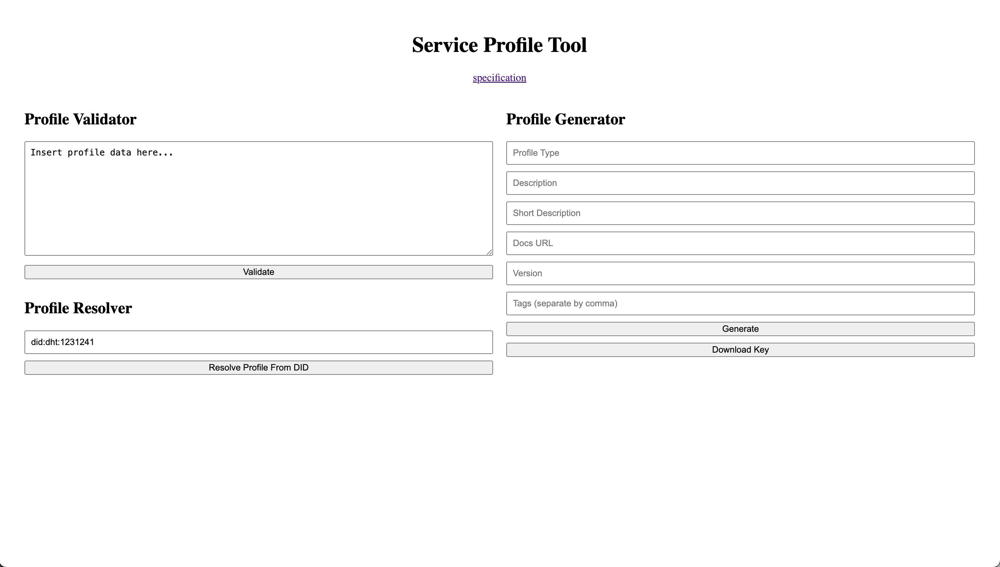

# service-profile-tool

Service profile tool is a tool that supports the [Service Profile Specification](https://github.com/trustoverip/tswg-trust-registry-service-profile) at ToIP.

## Features

- [x] Schema Validation
- [ ] Profile Generation
- [ ] Profile Validation

## Outputs

- [ ] CLI tool located at ./dist/bin/cli
- [ ] Website ( not hosted yet )
 
## Build

To build: 

`yarn build`

## Run

### CLI Tool

_yarn commands run against the builds in the ./bin folder_

#### Help

```sh
yarn cli --help
```

### Validate

```sh
yarn cli --validate -url <path-to-url>
```

## Screenshots

### Web UI



### CLI
