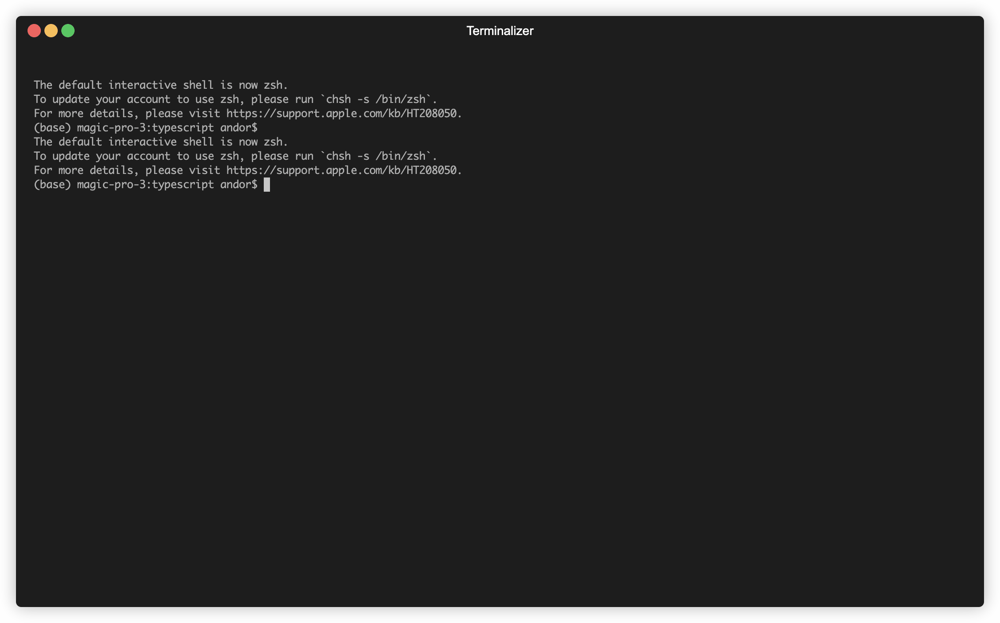

# service-profile-tool

[](https://github.com/andorsk/service-profile-tool/actions/workflows/ci.yml)

Service profile tool is a tool that supports the [Service Profile Specification](https://github.com/trustoverip/tswg-trust-registry-service-profile) at ToIP.

This is an educational tool. It is _NOT_ meant for production.

## Features

### CLI 

- [x] Profile Schema Validation
- [x] DID Resolution w/ Profile Support
- [x] Referencing Tool
- [x] Signature Validation
- [x] Profile Generation

### API 

_over http_

- [x] /POST Profile
- [x] /GET Profiles/Profiles
- [ ] Reference Profile
- [ ] Resolve DID
- [ ] Validate Profile
- [ ] Indexing Service / Profile Search

### Web UI 

The focus will be on the CLI to begin with. Eventually, we'll put up a front end for it. A starting point has been made 
in the `bin` directory. 

- [ ] Profile Validation
- [ ] Profile Generation
- [ ] DID Resolution w/ Profile Support
- [ ] Indexing Service / Profile Search
- [ ] Signature Validation
- [ ] Profile Hosting Service

## Outputs

- [ ] CLI tool located at ./dist/bin/cli
- [ ] Service APIs 
- [ ] Website ( not hosted yet )
 
## Build

To build: 

`yarn build`

## Run

### CLI Tool

_yarn commands run against the builds in the ./bin folder_

#### Help

```sh
yarn cli --help
```

#### Validate

Validate schema for a Service Profile

```sh
yarn cli --validate -url <path-to-url>
```

#### Verify

Verify Service Profile Over Cryptographic Proof

```sh
yarn cli --verify -url <path-to-url>
```

#### Resolve

Resolve a DID's Service Profile

```sh
yarn resolve <did>
```

#### Reference

Reference a Remote Service Profile

```sh
yarn reference <url>
```

## Screenshots

### Web UI


### CLI




## Code Structure

All code is in the `src` directory.

- `lib` is for library tools
- `bin` are entry points/executables
- `schemas` are schemas

## Dependencies

The service uses the [universolver](https://uniresolver.io/) to resolve DID's.
Thank you to DIF and the WG ID team for hosting the tool.
